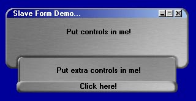



## Slave Form Demo

### Description

Among other things, this code demonstrates how to make 2 forms work together as if they were a single form. Make a form "hide" behind another and scroll down smoothly to reveal itself later. Also demonstrates how to make a custom title bar, the correct way to minimize an application, how to respond to the System Menu, and much more. It's hard to describe but it's well worth the download. Heavily commented code makes it very easy to follow what's happening. Votes and comments are appreciated!
 
### More Info
 
You should be familiar with VB subclassing techniques to fully understand this code. However, the comments should let even a novice follow what's going on.

             |
---                |---
**Submitted On**   |2000-08-09 14:07:50
**By**             |[Russ Suter](https://github.com/Planet-Source-Code/PSCIndex/blob/master/ByAuthor/russ-suter.md)
**Level**          |Advanced
**User Rating**    |4.7 (123 globes from 26 users)
**Compatibility**  |VB 6\.0
**Category**       |[Custom Controls/ Forms/  Menus](https://github.com/Planet-Source-Code/PSCIndex/blob/master/ByCategory/custom-controls-forms-menus__1-4.md)
**World**          |[Visual Basic](https://github.com/Planet-Source-Code/PSCIndex/blob/master/ByWorld/visual-basic.md)
**Archive File**   |[CODE\_UPLOAD8809892000\.zip](https://github.com/Planet-Source-Code/russ-suter-slave-form-demo__1-10571/archive/master.zip)

